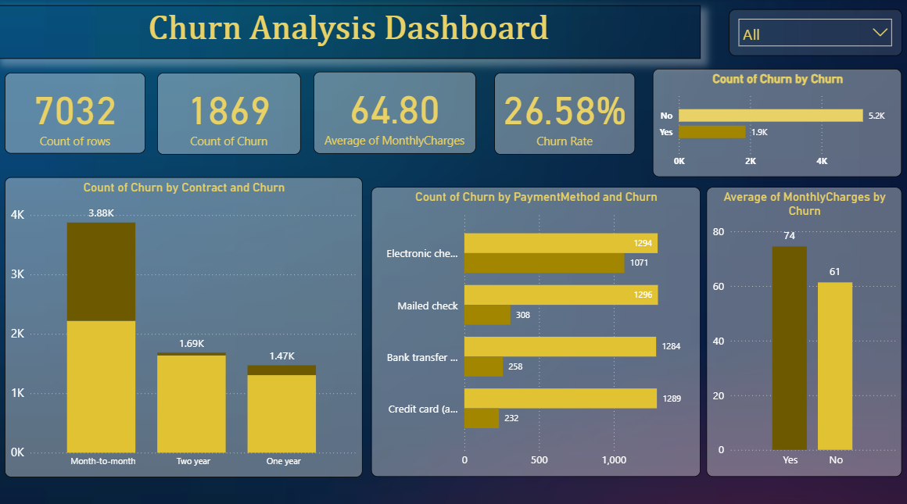

🚀 Project Overview

This project analyzes customer churn using Python, SQL, and Power BI to identify key factors influencing customer retention.

🛠 Tools Used:-       

	• Python (Pandas, Matplotlib, Seaborn)
	• SQL (MySQL)
	• Power BI

📊 Key Insights:- 

    • Month-to-month contracts have the highest churn
	• Customers with higher monthly charges are more likely to churn
	• Low tenure customers churn more
	•Long-term contracts reduce churn significantly

📁 Files in this Repository:-

	• cleaned_churn_data.csv → Python analysis
	• churn_analysis.sql → SQL queries
	• churn_dashboard.png → Power BI dashboard
	• Churn_analysis.ipynb

📌 Dashboard Preview

